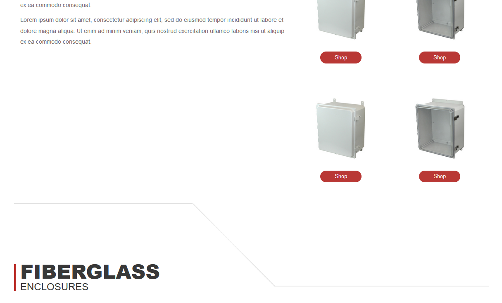
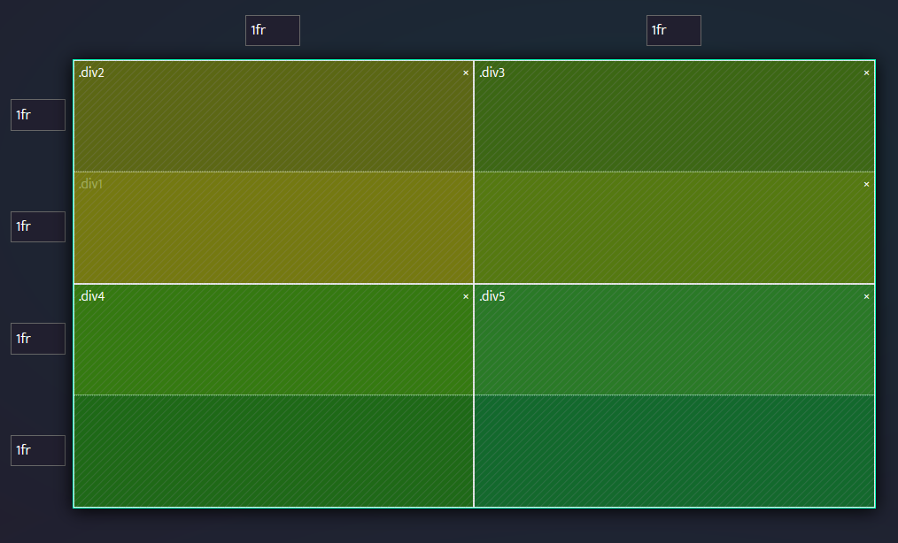
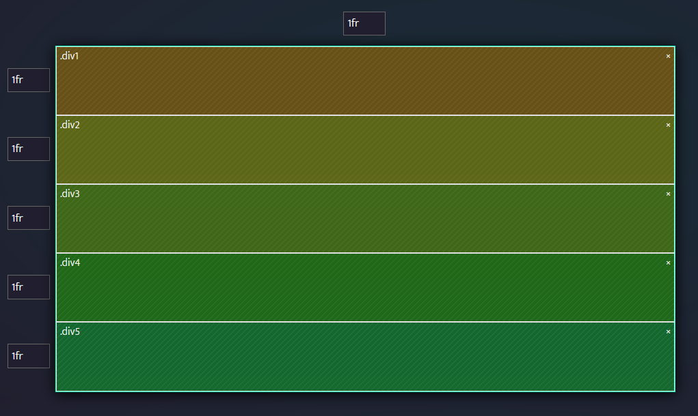

### Notes:
Saving this before I implement the grid system on the second and third product descriptions... *fingers crossed it goes well!*

# Idea:
- Have overlapping layers to remove the gap between 1 against 2&3
  
  
- 5 Sections:
  1. Image behind all 4 elements
  2. Description of first group of products
  3. Array of first group of GUI icons
  4. Description of second group of product
  5. Carousel of second group of GUI icons

### Before

### After

